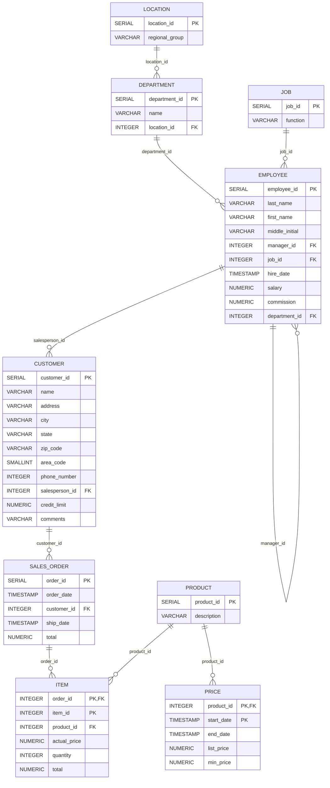

## Database schema

### Notes on the implementation

- The script in `sql/postgres_schema.sql` matches the relationships above and also sets foreign-key constraints for every link shown.
- The `item` table uses a composite primary key of `(order_id, item_id)` to align with the original data; this still enforces the relationships shown in the diagram.
- The `price` table accepts `end_date` as nullable to accommodate open-ended pricing rows while keeping `(product_id, start_date)` unique.
- All identifier columns are declared as `SERIAL` (or integer) with sequences reset to the maximum seeded values for seamless additional inserts.
